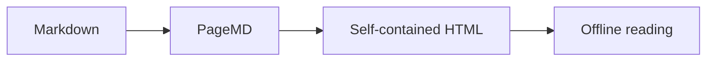
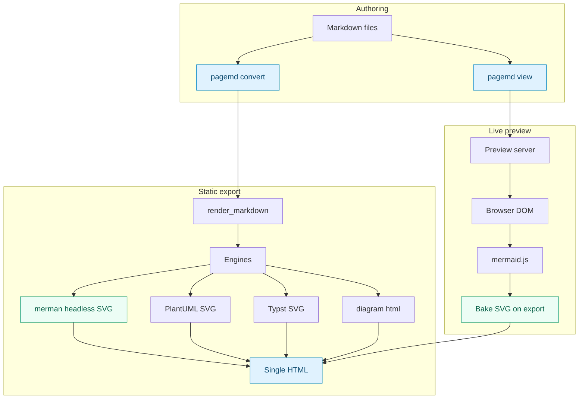
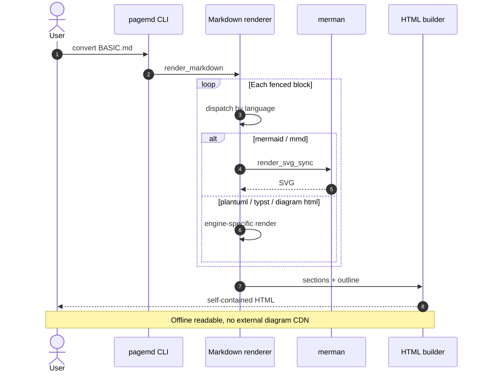
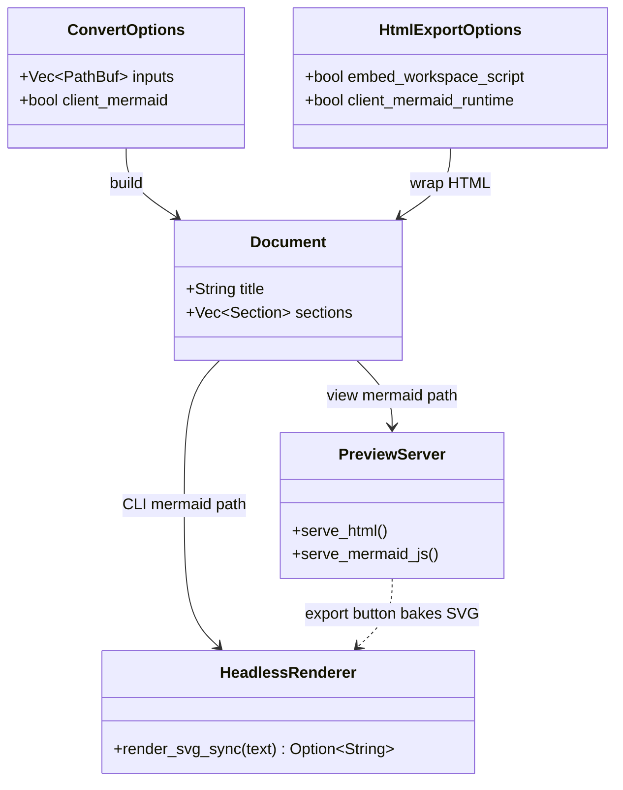
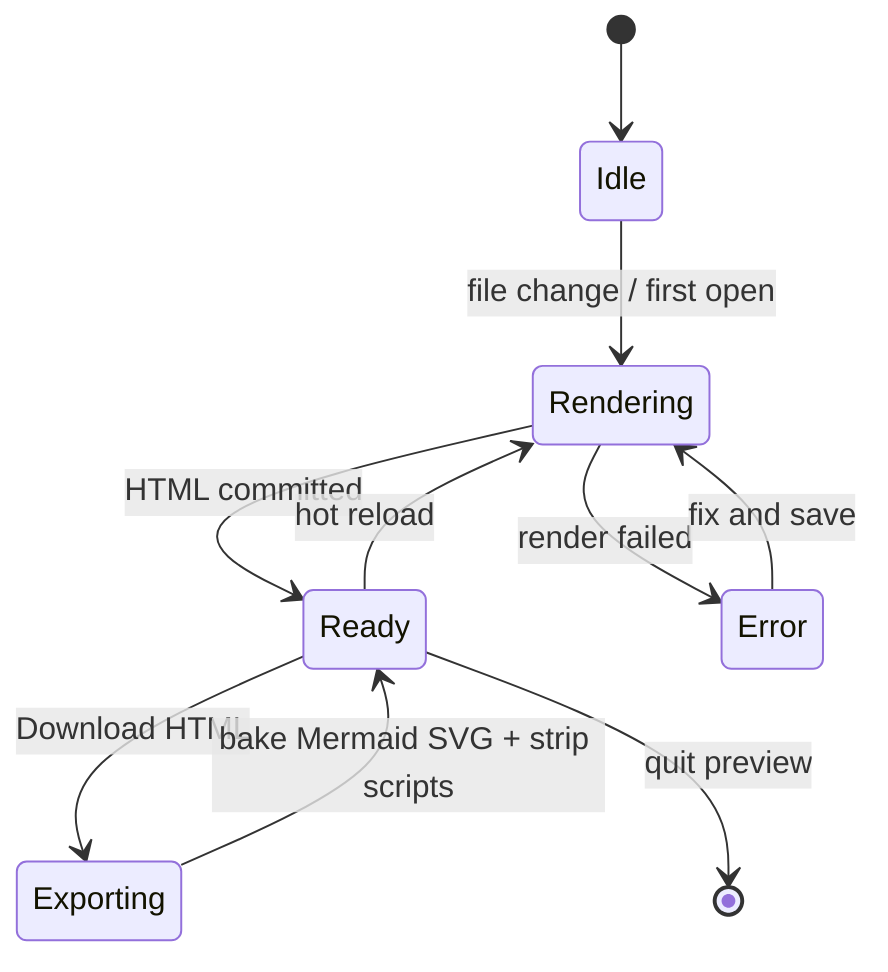
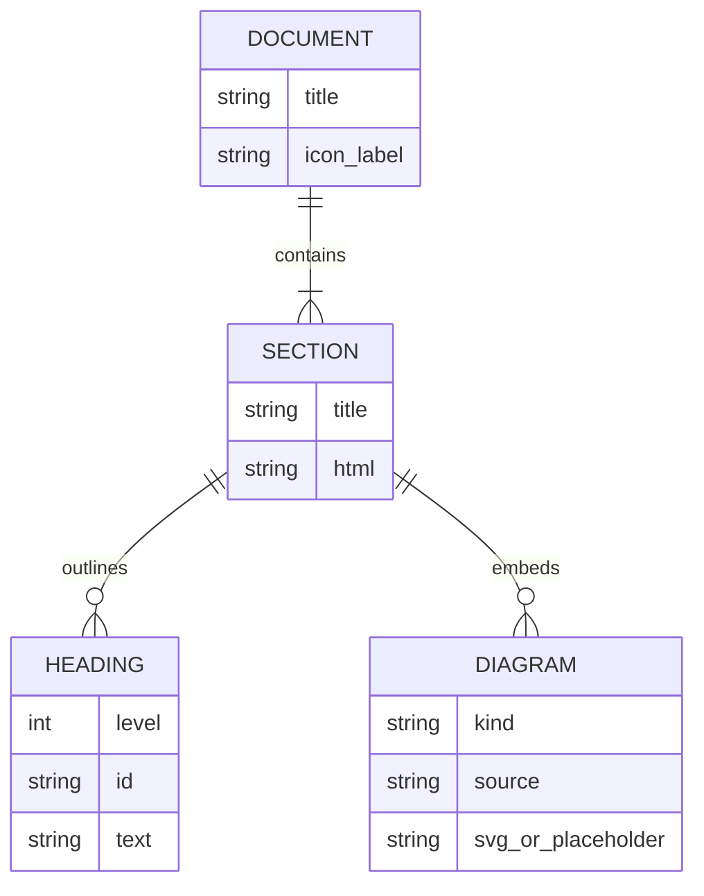
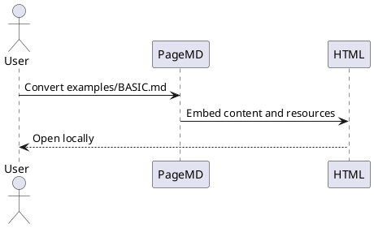

# PageMD Basic Example

This file is a conversion fixture for PageMD. Convert it directly to HTML to verify the supported Markdown features:

```bash
cargo run -- --input examples/BASIC.md --output pagemd-basic.html
```

## Basic Markdown

# Heading level 1 example

## Heading level 2 example

### Heading level 3 example

This paragraph includes **strong text**, *emphasis*, `inline code`, a [link](https://example.com), and ~~strikethrough~~.

> A regular blockquote remains a blockquote unless it uses a callout marker.

- Unordered item
- Another unordered item
  - Nested item

1. Ordered item
2. Another ordered item

- [x] Completed task
- [ ] Pending task

## Rich Tables

| Feature | Syntax | Alignment | Status | Score | Notes |
|---|---|:---:|---|---:|---|
| Tables | `| cell |` | Center | Ready | 100 | Zebra rows, hover state, borders, and responsive overflow are styled. |
| Code | `` `inline` `` | Center | Ready | 96 | Inline code inside cells is rendered as a compact badge. |
| Math | `$x+y$` | Center | Ready | 94 | Inline math works inside table cells: $x+y$. |
| Callouts | `> [!NOTE]` | Center | Ready | 92 | Use callouts outside tables for richer block content. |
| Diagrams | `mermaid` / `plantuml` / `typst` / `diagram html` | Center | Ready | 90 | Diagram blocks are rendered as embedded graphics or styled HTML. |
| Footnotes | `[^id]` | Center | Ready | 95 | Hover a superscript to preview; see **Footnotes** section below. |

## Footnotes

PageMD resolves footnotes at **section** scope: references and definitions can live in different blocks (paragraph, callout, table, list). Hover a superscript to preview the note; move the pointer into the popup to select or copy text.

### Basic references

Single reference in a paragraph.[^basic-one]

[^basic-one]: Simple footnote definition on the next line.

Two references in one paragraph: first[^pair-a], then[^pair-b].

[^pair-a]: First of a pair.
[^pair-b]: Second of a pair.

The same label may appear more than once in the text[^repeat] — including here[^repeat] — and both link to one definition.

[^repeat]: One definition shared by multiple references.

### Rich footnote bodies

Footnotes can contain **bold**, *emphasis*, `inline code`, and [links](https://example.com).[^rich-body]

[^rich-body]: Example with **bold**, *emphasis*, `code`, and [a link](https://example.com).

Multiline bodies use a four-space indent on continuation lines:[^multi-line]

[^multi-line]: First line of a longer note.
    Second line continues here.
    Third line as well.

### Footnotes in lists, tables, and blockquotes

- Unordered list item with a footnote[^list-fn].
- Second item references the same note again[^list-fn].

[^list-fn]: Footnote referenced from a list item.

| Location | Example |
| --- | --- |
| Table cell | Inline math $E=mc^2$ and a footnote[^table-fn] in one cell. |

[^table-fn]: Definition for a table-cell reference.

> Plain blockquote (not a callout) with a footnote[^quote-fn].

[^quote-fn]: Definition for a regular blockquote.

### Grouped and unreferenced definitions

Paragraph referencing two notes[^group-a][^group-b] with definitions listed together below.

[^group-a]: First definition in a consecutive block.
[^group-b]: Second definition immediately after the first.
[^group-orphan]: This line has **no reference** anywhere in the document — it should still appear as a standalone footnote.

## Code Highlighting

```rust
fn main() {
    let message = "Hello from PageMD";
    println!("{message}");
}
```

```typescript
const features = ['markdown', 'math', 'mermaid', 'plantuml', 'typst', 'diagram html', 'callouts'];
console.log(features.join(', '));
```

## Math

Inline math is supported: $E = mc^2$ and $a^2 + b^2 = c^2$.

Display math is supported:

$$
\int_0^1 x^2\,dx = \frac{1}{3}
$$

A fenced math block is also supported:

```math
\sum_{k=1}^{n} k = \frac{n(n+1)}{2}
```

## Mermaid

Simple flowchart:



Nested subgraphs with cross-cluster edges (layout stress test):



Sequence diagram with alt / loop / notes:



Class diagram (renderer surface):



State diagram for preview lifecycle:



ER diagram (document model):



Gantt-style convert pipeline:

```mermaid
gantt
  title PageMD convert pipeline
  dateFormat X
  axisFormat %s
  section Resolve
    Collect inputs           :a1, 0, 2
    Prepare resources        :a2, after a1, 3
  section Render
    Markdown + extensions    :b1, after a2, 5
    Mermaid via merman       :b2, after b1, 3
    PlantUML / Typst / HTML  :b3, after b1, 4
  section Export
    Build nav + outline      :c1, after b2, 2
    Write single HTML        :c2, after c1, 1
```



## PlantUML



## Typst

Built-in packages (offline): `@preview/cetz:0.3.2`, `@preview/fletcher:0.5.8`, `@preview/codelst:2.0.2`.

```typst
#import "@preview/cetz:0.3.2"
#cetz.canvas({
  import cetz.draw: *
  circle((0, 0), radius: 1, fill: rgb("#0969da").lighten(35%))
  content((0, 0), [$arrow.r$ PageMD], anchor: "center")
})
```

Plain Typst (no package) also works:

```typst
#circle(radius: 28pt, fill: rgb("#0969da").lighten(40%))
#text(size: 12pt)[Typst → SVG]
```

## HTML Diagram

The `diagram html` fence renders raw HTML with the Tailwind utility bundle embedded into the PageMD binary.

```diagram html
<div class="relative mx-auto max-w-5xl rounded-3xl border border-slate-200 bg-white p-6">
  <div class="relative rounded-3xl border border-sky-200 bg-gradient-to-br from-sky-50 via-white to-indigo-50 p-6">
    <svg viewBox="0 0 960 650" role="img" aria-label="PageMD rendering architecture" class="w-full">
      <defs>
        <linearGradient id="pagemd-card" x1="0" x2="1" y1="0" y2="1">
          <stop offset="0%" stop-color="#ffffff"/>
          <stop offset="100%" stop-color="#f8fafc"/>
        </linearGradient>
        <linearGradient id="pagemd-core" x1="0" x2="1" y1="0" y2="1">
          <stop offset="0%" stop-color="#e0f2fe"/>
          <stop offset="100%" stop-color="#eef2ff"/>
        </linearGradient>
        <marker id="pagemd-arrow" markerWidth="8" markerHeight="8" refX="7" refY="4" orient="auto">
          <path d="M1,1 L7,4 L1,7 Z" fill="#0284c7"/>
        </marker>
        <marker id="pagemd-arrow-muted" markerWidth="8" markerHeight="8" refX="7" refY="4" orient="auto">
          <path d="M1,1 L7,4 L1,7 Z" fill="#94a3b8"/>
        </marker>
      </defs>

      <rect x="32" y="28" width="896" height="590" rx="28" fill="#ffffff" opacity="0.72"/>
      <rect x="32" y="28" width="896" height="590" rx="28" fill="none" stroke="#dbeafe"/>

      <text x="64" y="76" fill="#0369a1" font-size="13" font-weight="700" letter-spacing="3">RUNTIME FLOW</text>
      <text x="64" y="104" fill="#0f172a" font-size="24" font-weight="800">One renderer, multiple diagram engines, one portable HTML artifact</text>

      <g>
        <rect x="70" y="145" width="190" height="82" rx="18" fill="url(#pagemd-card)" stroke="#cbd5e1"/>
        <text x="92" y="177" fill="#0f172a" font-size="16" font-weight="800">CLI / View</text>
        <text x="92" y="202" fill="#64748b" font-size="12">input files, directories,</text>
        <text x="92" y="220" fill="#64748b" font-size="12">export target, preview server</text>

        <rect x="310" y="145" width="190" height="82" rx="18" fill="url(#pagemd-card)" stroke="#cbd5e1"/>
        <text x="332" y="177" fill="#0f172a" font-size="16" font-weight="800">Input Resolver</text>
        <text x="332" y="202" fill="#64748b" font-size="12">dedupe Markdown files</text>
        <text x="332" y="220" fill="#64748b" font-size="12">and establish base paths</text>

        <rect x="550" y="145" width="340" height="82" rx="18" fill="url(#pagemd-card)" stroke="#cbd5e1"/>
        <text x="572" y="177" fill="#0f172a" font-size="16" font-weight="800">Render Resources</text>
        <text x="572" y="202" fill="#64748b" font-size="12">syntax themes, KaTeX fonts, bundled Typst packages,</text>
        <text x="572" y="220" fill="#64748b" font-size="12">and diagram Tailwind CSS from build.rs</text>
      </g>

      <path d="M260 186 H300" stroke="#0284c7" stroke-width="2" stroke-linecap="round" marker-end="url(#pagemd-arrow)"/>
      <path d="M500 186 H540" stroke="#0284c7" stroke-width="2" stroke-linecap="round" marker-end="url(#pagemd-arrow)"/>
      <path d="M405 227 V254 Q405 270 421 270 H480 V282" fill="none" stroke="#0284c7" stroke-width="2" stroke-linecap="round" stroke-linejoin="round" marker-end="url(#pagemd-arrow)"/>
      <path d="M720 227 V254 Q720 270 704 270 H480 V282" fill="none" stroke="#0284c7" stroke-width="2" stroke-linecap="round" stroke-linejoin="round" marker-end="url(#pagemd-arrow)"/>

      <g>
        <rect x="240" y="282" width="480" height="92" rx="24" fill="url(#pagemd-core)" stroke="#93c5fd" stroke-width="1.5"/>
        <text x="480" y="318" text-anchor="middle" fill="#075985" font-size="13" font-weight="700" letter-spacing="2">CORE RENDERER</text>
        <text x="480" y="348" text-anchor="middle" fill="#0f172a" font-size="24" font-weight="800">render_markdown_with_depth</text>
        <text x="480" y="368" text-anchor="middle" fill="#475569" font-size="12">Pulldown events + PageMD extensions + fenced-block dispatch</text>
      </g>

      <path d="M480 374 V404" stroke="#0284c7" stroke-width="2" stroke-linecap="round" marker-end="url(#pagemd-arrow)"/>

      <g>
        <rect x="72" y="430" width="168" height="82" rx="18" fill="url(#pagemd-card)" stroke="#c7d2fe"/>
        <text x="156" y="462" text-anchor="middle" fill="#4338ca" font-size="14" font-weight="800">Markdown</text>
        <text x="156" y="486" text-anchor="middle" fill="#64748b" font-size="12">headings, tables,</text>
        <text x="156" y="504" text-anchor="middle" fill="#64748b" font-size="12">links, resources</text>

        <rect x="282" y="430" width="168" height="82" rx="18" fill="url(#pagemd-card)" stroke="#c7d2fe"/>
        <text x="366" y="462" text-anchor="middle" fill="#4338ca" font-size="14" font-weight="800">Math + Callouts</text>
        <text x="366" y="486" text-anchor="middle" fill="#64748b" font-size="12">LaTeX SVG and</text>
        <text x="366" y="504" text-anchor="middle" fill="#64748b" font-size="12">nested Markdown bodies</text>

        <rect x="510" y="430" width="168" height="82" rx="18" fill="url(#pagemd-card)" stroke="#c7d2fe"/>
        <text x="594" y="462" text-anchor="middle" fill="#4338ca" font-size="14" font-weight="800">Diagram Engines</text>
        <text x="594" y="486" text-anchor="middle" fill="#64748b" font-size="12">Mermaid, PlantUML,</text>
        <text x="594" y="504" text-anchor="middle" fill="#64748b" font-size="12">Typst, diagram html</text>

        <rect x="720" y="430" width="168" height="82" rx="18" fill="url(#pagemd-card)" stroke="#c7d2fe"/>
        <text x="804" y="462" text-anchor="middle" fill="#4338ca" font-size="14" font-weight="800">HTML Builder</text>
        <text x="804" y="486" text-anchor="middle" fill="#64748b" font-size="12">CSS, favicon, nav,</text>
        <text x="804" y="504" text-anchor="middle" fill="#64748b" font-size="12">outline, scripts</text>
      </g>

      <path d="M480 404 H156 V420" fill="none" stroke="#94a3b8" stroke-width="1.8" stroke-linecap="round" stroke-linejoin="round" marker-end="url(#pagemd-arrow-muted)"/>
      <path d="M480 404 H366 V420" fill="none" stroke="#94a3b8" stroke-width="1.8" stroke-linecap="round" stroke-linejoin="round" marker-end="url(#pagemd-arrow-muted)"/>
      <path d="M480 404 H594 V420" fill="none" stroke="#94a3b8" stroke-width="1.8" stroke-linecap="round" stroke-linejoin="round" marker-end="url(#pagemd-arrow-muted)"/>
      <path d="M480 404 H804 V420" fill="none" stroke="#94a3b8" stroke-width="1.8" stroke-linecap="round" stroke-linejoin="round" marker-end="url(#pagemd-arrow-muted)"/>
      <path d="M678 471 H710" stroke="#0284c7" stroke-width="2" stroke-linecap="round" marker-end="url(#pagemd-arrow)"/>

      <path d="M804 512 V532 Q804 542 794 542 H748 V548" fill="none" stroke="#0284c7" stroke-width="2" stroke-linecap="round" stroke-linejoin="round" marker-end="url(#pagemd-arrow)"/>
      <path d="M804 532 Q804 542 794 542 H212 V548" fill="none" stroke="#94a3b8" stroke-width="1.8" stroke-linecap="round" stroke-linejoin="round" marker-end="url(#pagemd-arrow-muted)"/>

      <rect x="110" y="548" width="204" height="42" rx="21" fill="#ecfeff" stroke="#67e8f9"/>
      <text x="212" y="574" text-anchor="middle" fill="#155e75" font-size="13" font-weight="800">Export: single HTML file</text>

      <rect x="646" y="548" width="204" height="42" rx="21" fill="#f0fdf4" stroke="#86efac"/>
      <text x="748" y="574" text-anchor="middle" fill="#166534" font-size="13" font-weight="800">Preview: hot reload browser</text>
    </svg>
  </div>
</div>
```

## Admonitions and Callouts

### Callouts without footnotes

> [!NOTE] GitHub-style callout
> This callout supports **Markdown** content and inline math like $x + y$.

> [!TIP]
> Use `cargo run -- view --input examples/BASIC.md` to render and preview this document quickly.

### Footnotes inside callouts

Each block below exercises a different AI / author pattern. Definitions may sit **inside** the callout (`>` on every line), **after** the callout (no `>`), or **between** other definitions.

> [!QUOTE] Trailing definition (no `>` after the quote)
> The reference[^callout-trailing] is inside the callout; the definition follows the closing quote line without blockquote markers.

[^callout-trailing]: Typical AI output — definition immediately after the callout block.

> [!NOTE] Inline definition (inside the quote)
> Both the reference[^callout-inline] and its definition can use `>` on every line.
> [^callout-inline]: Definition on a continued `>` line inside the same callout.

> [!QUOTE] Table in callout + partial row prefix
> | Item | Note |
> | --- | --- |
> | Widget A | Footnote[^table-note] in this cell. |

[^table-note]: Only the header row uses `>` — remaining table rows and this definition follow without blockquote prefixes (common AI pattern).

> [!NOTE] Multiple references, definitions out of order
> See[^multi-a] and[^multi-b] in one callout; definitions below may include an unrelated line between them.

[^multi-a]: First definition.
[^unused-note]: Unreferenced line between two related definitions — should still render on its own.
[^multi-b]: Second definition (label order in source need not match reference order).

:::tip Fenced admonition (`:::`)
Reference inside a fenced admonition[^fenced-note]. Definition after the closing `:::`.
:::

[^fenced-note]: Definition trailing a `:::tip` block.

!!! note "Indented admonition (`!!!`)"
    Indented admonition body with a footnote[^indented-note]. Definition follows the indented block.

[^indented-note]: Definition after an `!!!` admonition.

> [!WARNING] First of two callouts
> Separate callout with its own footnote[^callout-a].

> [!WARNING] Second of two callouts
> Another callout with a different footnote[^callout-b].

[^callout-a]: Definition for the first warning callout.
[^callout-b]: Definition for the second warning callout.

### Callouts without footnotes (continued)

:::warning Fenced admonition
This fenced admonition is converted into a styled callout block.
:::

!!! important "Indented admonition"
    This indented admonition is also converted into a styled callout block.

## Embedded Resources

Remote images are fetched and embedded as `data:` URIs when possible:


Raw HTML image resources are also rewritten when possible:


Raw HTML CSS `url(...)` resources are rewritten when possible:

<style>
.pagemd-resource-demo {
  min-height: 48px;
  padding: 0.75rem 1rem 0.75rem 56px;
  border: 1px solid #e2e8f0;
  border-radius: 12px;
  background-image: url("https://www.rust-lang.org/logos/rust-logo-32x32.png");
  background-position: 16px center;
  background-repeat: no-repeat;
  background-size: 32px 32px;
}
</style>

<div class="pagemd-resource-demo">This block uses a background image from raw HTML CSS.</div>
