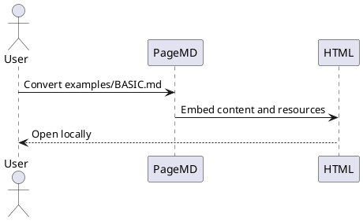

# PageMD Basic Example

This file is a conversion fixture for PageMD. Convert it directly to HTML to verify the supported Markdown features:

```bash
cargo run -- --input examples/BASIC.md --output pagemd-basic.html
```

## Basic Markdown

# Heading level 1 example

## Heading level 2 example

### Heading level 3 example

This paragraph includes **strong text**, *emphasis*, `inline code`, a [link](https://example.com), and ~~strikethrough~~.

> A regular blockquote remains a blockquote unless it uses a callout marker.

- Unordered item
- Another unordered item
  - Nested item

1. Ordered item
2. Another ordered item

- [x] Completed task
- [ ] Pending task

## Rich Tables

| Feature | Syntax | Alignment | Status | Score | Notes |
|---|---|:---:|---|---:|---|
| Tables | `| cell |` | Center | Ready | 100 | Zebra rows, hover state, borders, and responsive overflow are styled. |
| Code | `` `inline` `` | Center | Ready | 96 | Inline code inside cells is rendered as a compact badge. |
| Math | `$x+y$` | Center | Ready | 94 | Inline math works inside table cells: $x+y$. |
| Callouts | `> [!NOTE]` | Center | Ready | 92 | Use callouts outside tables for richer block content. |
| Diagrams | `mermaid` / `plantuml` | Center | Ready | 90 | Diagram blocks are rendered as embedded graphics. |

Here is a footnote reference.[^demo]

[^demo]: This is a footnote rendered by PageMD.

## Code Highlighting

```rust
fn main() {
    let message = "Hello from PageMD";
    println!("{message}");
}
```

```typescript
const features = ['markdown', 'math', 'mermaid', 'plantuml', 'callouts'];
console.log(features.join(', '));
```

## Math

Inline math is supported: $E = mc^2$ and $a^2 + b^2 = c^2$.

Display math is supported:

$$
\int_0^1 x^2\,dx = \frac{1}{3}
$$

A fenced math block is also supported:

```math
\sum_{k=1}^{n} k = \frac{n(n+1)}{2}
```

## Mermaid


## PlantUML



## Admonitions and Callouts

> [!NOTE] GitHub-style callout
> This callout supports **Markdown** content and inline math like $x + y$.

> [!TIP]
> Use `cargo run -- view --input examples/BASIC.md` to render and preview this document quickly.

:::warning Fenced admonition
This fenced admonition is converted into a styled callout block.
:::

!!! important "Indented admonition"
    This indented admonition is also converted into a styled callout block.

## Embedded Resources

Remote images are fetched and embedded as `data:` URIs when possible:


Raw HTML image resources are also rewritten when possible:


Raw HTML CSS `url(...)` resources are rewritten when possible:

<style>
.pagemd-resource-demo {
  min-height: 48px;
  padding: 0.75rem 1rem 0.75rem 56px;
  border: 1px solid #e2e8f0;
  border-radius: 12px;
  background-image: url("https://www.rust-lang.org/logos/rust-logo-32x32.png");
  background-position: 16px center;
  background-repeat: no-repeat;
  background-size: 32px 32px;
}
</style>

<div class="pagemd-resource-demo">This block uses a background image from raw HTML CSS.</div>
