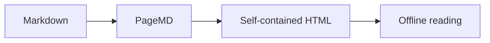
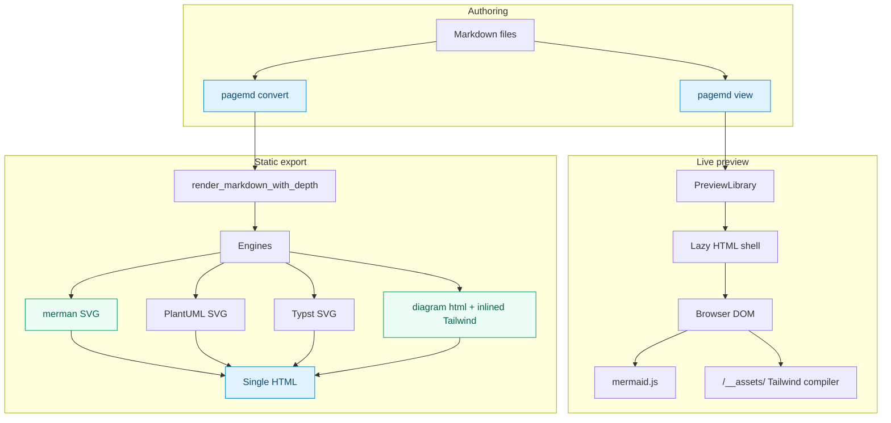
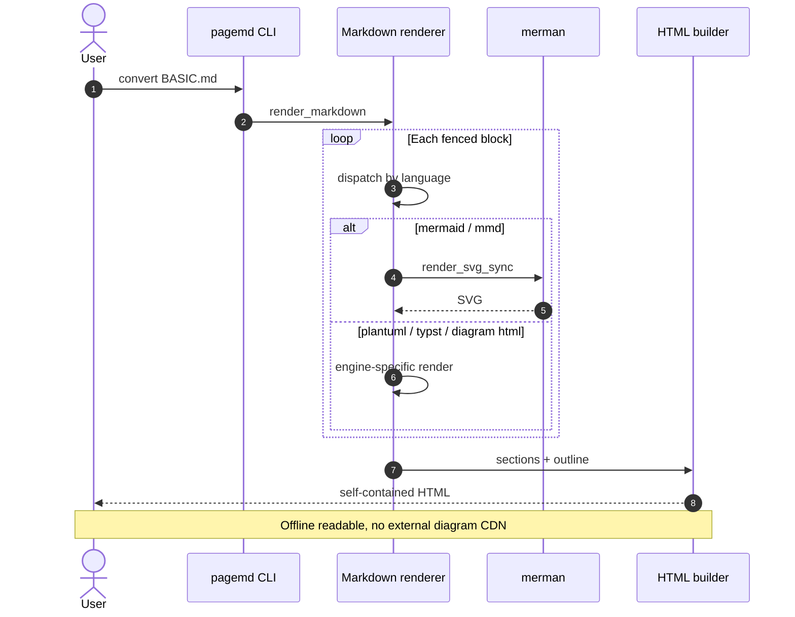
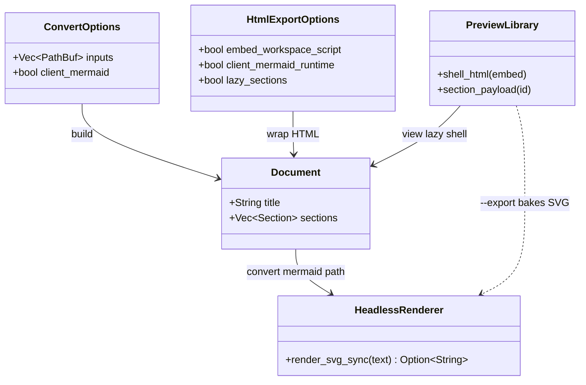
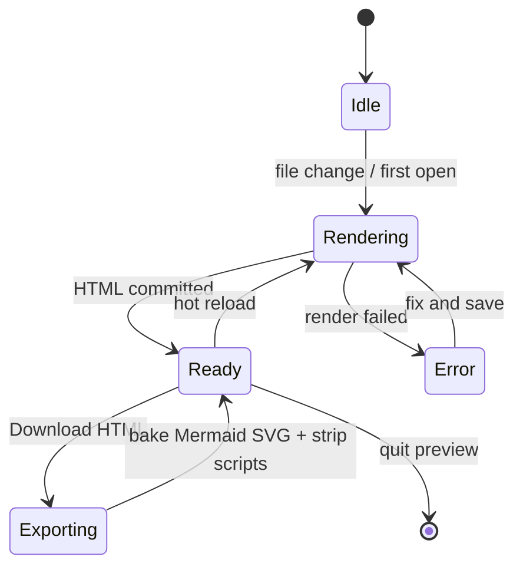
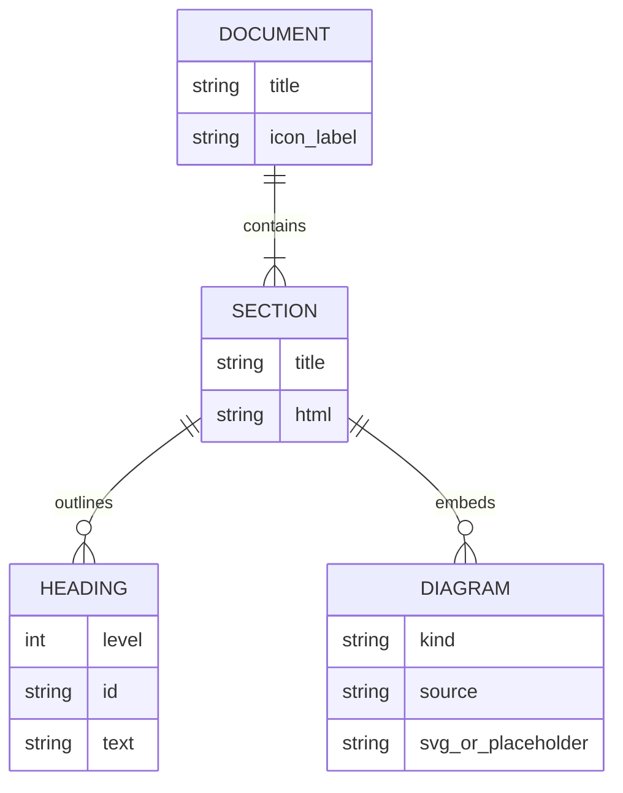
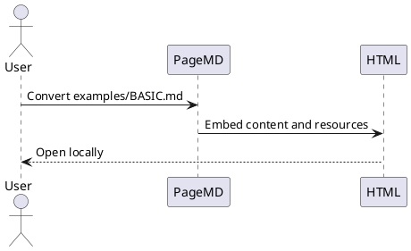

# PageMD Basic Example

This file is a conversion fixture for PageMD. Convert it directly to HTML to verify the supported Markdown features:

```bash
cargo run -- --input examples/BASIC.md --output pagemd-basic.html
```

## Basic Markdown

# Heading level 1 example

## Heading level 2 example

### Heading level 3 example

This paragraph includes **strong text**, *emphasis*, `inline code`, a [link](https://example.com), and ~~strikethrough~~.

> A regular blockquote remains a blockquote unless it uses a callout marker.

- Unordered item
- Another unordered item
  - Nested item

1. Ordered item
2. Another ordered item

- [x] Completed task
- [ ] Pending task

## Tables

GFM pipe tables. Alignment is set in the delimiter row: `:---` left, `:---:` center, `---:` right.

| Left `:---` | Center `:---:` | Right `---:` |
|:---|:---:|---:|
| `` `code` `` | `\| cell \|` | $x+y$ |

A `|` inside a cell must be written `\|` (also inside `` `code` ``). Cells take inline Markdown (code, math, links, footnotes). Callouts and diagram fences are blocks — keep them outside the table.

The HTML output adds zebra rows, hover, borders, and horizontal scroll when the table is wider than the viewport.

## Footnotes

PageMD resolves footnotes at **section** scope: references and definitions can live in different blocks (paragraph, callout, table, list). Hover a superscript to preview the note; move the pointer into the popup to select or copy text.

### Basic references

Single reference in a paragraph.[^basic-one]

[^basic-one]: Simple footnote definition on the next line.

Two references in one paragraph: first[^pair-a], then[^pair-b].

[^pair-a]: First of a pair.
[^pair-b]: Second of a pair.

The same label may appear more than once in the text[^repeat] — including here[^repeat] — and both link to one definition.

[^repeat]: One definition shared by multiple references.

### Rich footnote bodies

Footnotes can contain **bold**, *emphasis*, `inline code`, and [links](https://example.com).[^rich-body]

[^rich-body]: Example with **bold**, *emphasis*, `code`, and [a link](https://example.com).

Multiline bodies use a four-space indent on continuation lines:[^multi-line]

[^multi-line]: First line of a longer note.
    Second line continues here.
    Third line as well.

### Footnotes in lists, tables, and blockquotes

- Unordered list item with a footnote[^list-fn].
- Second item references the same note again[^list-fn].

[^list-fn]: Footnote referenced from a list item.

| Location | Example |
| --- | --- |
| Table cell | Inline math $E=mc^2$ and a footnote[^table-fn] in one cell. |

[^table-fn]: Definition for a table-cell reference.

> Plain blockquote (not a callout) with a footnote[^quote-fn].

[^quote-fn]: Definition for a regular blockquote.

### Grouped and unreferenced definitions

Paragraph referencing two notes[^group-a][^group-b] with definitions listed together below.

[^group-a]: First definition in a consecutive block.
[^group-b]: Second definition immediately after the first.
[^group-orphan]: This line has **no reference** anywhere in the document — it should still appear as a standalone footnote.

## Code Highlighting

```rust
fn main() {
    let message = "Hello from PageMD";
    println!("{message}");
}
```

```typescript
const features = ['markdown', 'math', 'mermaid', 'plantuml', 'typst', 'diagram html', 'callouts'];
console.log(features.join(', '));
```

## Math

Inline math is supported: $E = mc^2$ and $a^2 + b^2 = c^2$.

Display math is supported:

$$
\int_0^1 x^2\,dx = \frac{1}{3}
$$

A fenced math block is also supported:

```math
\sum_{k=1}^{n} k = \frac{n(n+1)}{2}
```

## Mermaid

Simple flowchart:


```mermaid
flowchart LR
  A[Markdown] --> B[PageMD]
  B --> C[Self-contained HTML]
  C --> D[Offline reading]
```

Nested subgraphs with cross-cluster edges (layout stress test):


```mermaid
flowchart TB
  subgraph Authoring["Authoring"]
    direction LR
    MD[Markdown files] --> View[pagemd view]
    MD --> CLI[pagemd convert]
  end

  subgraph Preview["Live preview"]
    direction TB
    Lib[PreviewLibrary] --> Shell[Lazy HTML shell]
    Shell --> Browser[Browser DOM]
    Browser --> MermaidJS[mermaid.js]
    Browser --> Tw["/__assets/ Tailwind compiler"]
  end

  subgraph Export["Static export"]
    direction TB
    Pipeline[render_markdown_with_depth] --> Engines
    Engines --> Merman[merman SVG]
    Engines --> PlantUML[PlantUML SVG]
    Engines --> Typst[Typst SVG]
    Engines --> HtmlDiag[diagram html + inlined Tailwind]
    Merman --> Bundle[Single HTML]
    PlantUML --> Bundle
    Typst --> Bundle
    HtmlDiag --> Bundle
  end

  View --> Lib
  CLI --> Pipeline

  classDef accent fill:#e0f2fe,stroke:#0284c7,color:#0c4a6e
  classDef result fill:#ecfdf5,stroke:#059669,color:#065f46
  class View,CLI,Bundle accent
  class Merman,HtmlDiag result
```

Sequence diagram with alt / loop / notes:


```mermaid
sequenceDiagram
  autonumber
  actor User
  participant CLI as pagemd CLI
  participant Core as Markdown renderer
  participant Merman as merman
  participant HTML as HTML builder

  User->>CLI: convert BASIC.md
  CLI->>Core: render_markdown
  loop Each fenced block
    Core->>Core: dispatch by language
    alt mermaid / mmd
      Core->>Merman: render_svg_sync
      Merman-->>Core: SVG
    else plantuml / typst / diagram html
      Core->>Core: engine-specific render
    end
  end
  Core->>HTML: sections + outline
  HTML-->>User: self-contained HTML
  Note over User,HTML: Offline readable, no external diagram CDN
```

Class diagram (renderer surface):


```mermaid
classDiagram
  direction TB
  class ConvertOptions {
    +Vec~PathBuf~ inputs
    +bool client_mermaid
  }
  class HtmlExportOptions {
    +bool embed_workspace_script
    +bool client_mermaid_runtime
    +bool lazy_sections
  }
  class PreviewLibrary {
    +shell_html(embed)
    +section_payload(id)
  }
  class Document {
    +String title
    +Vec~Section~ sections
  }
  class HeadlessRenderer {
    +render_svg_sync(text) Option~String~
  }

  ConvertOptions --> Document : build
  HtmlExportOptions --> Document : wrap HTML
  Document --> HeadlessRenderer : convert mermaid path
  PreviewLibrary --> Document : view lazy shell
  PreviewLibrary ..> HeadlessRenderer : --export bakes SVG
```

State diagram for preview lifecycle:


```mermaid
stateDiagram-v2
  [*] --> Idle
  Idle --> Rendering: file change / first open
  Rendering --> Ready: HTML committed
  Rendering --> Error: render failed
  Error --> Rendering: fix and save
  Ready --> Rendering: hot reload
  Ready --> Exporting: Download HTML
  Exporting --> Ready: bake Mermaid SVG + strip scripts
  Ready --> [*]: quit preview
```

ER diagram (document model):


```mermaid
erDiagram
  DOCUMENT ||--|{ SECTION : contains
  SECTION ||--o{ HEADING : outlines
  SECTION ||--o{ DIAGRAM : embeds
  DIAGRAM {
    string kind
    string source
    string svg_or_placeholder
  }
  SECTION {
    string title
    string html
  }
  DOCUMENT {
    string title
    string icon_label
  }
  HEADING {
    int level
    string id
    string text
  }
```

Gantt-style convert pipeline:


```mermaid
gantt
  title PageMD convert pipeline
  dateFormat X
  axisFormat %s
  section Resolve
    Collect inputs           :a1, 0, 2
    Prepare resources        :a2, after a1, 3
  section Render
    Markdown + extensions    :b1, after a2, 5
    Mermaid via merman       :b2, after b1, 3
    PlantUML / Typst / HTML  :b3, after b1, 4
  section Export
    Build nav + outline      :c1, after b2, 2
    Write single HTML        :c2, after c1, 1
```

## PlantUML


```plantuml
@startuml
actor User
participant PageMD
participant HTML
User -> PageMD: Convert examples/BASIC.md
PageMD -> HTML: Embed content and resources
HTML --> User: Open locally
@enduml
```

## Typst

Built-in packages (offline): `@preview/cetz:0.3.2`, `@preview/fletcher:0.5.8`, `@preview/codelst:2.0.2`.

```typst
#import "@preview/cetz:0.3.2"
#cetz.canvas({
  import cetz.draw: *
  circle((0, 0), radius: 1, fill: rgb("#0969da").lighten(35%))
  content((0, 0), [$arrow.r$ PageMD], anchor: "center")
})
```

Plain Typst (no package) also works:

```typst
#circle(radius: 28pt, fill: rgb("#0969da").lighten(40%))
#text(size: 12pt)[Typst → SVG]
```

## HTML Diagram

The `diagram html` fence renders raw HTML. Tailwind utilities are compiled in the browser, scoped to `.diagram-html-display` so they do not restyle the PageMD chrome.

Architecture (convert vs view, engines, artifacts):

```diagram html
<div class="rounded-3xl border border-slate-200 bg-gradient-to-br from-slate-50 via-white to-sky-50 p-5 shadow-sm">
  <div class="mb-4 flex flex-wrap items-end justify-between gap-3">
    <div>
      <div class="text-xs font-bold uppercase tracking-[0.24em] text-sky-700">PageMD runtime</div>
      <div class="mt-1 text-2xl font-extrabold text-slate-900">One renderer, two artifacts</div>
    </div>
    <div class="rounded-full border border-sky-200 bg-sky-50 px-4 py-2 text-sm font-semibold text-sky-800">CLI · View · Library · Browser</div>
  </div>

  <div class="grid grid-cols-2 gap-3 md:grid-cols-4">
    <div class="rounded-2xl border border-indigo-200 bg-indigo-50 p-4">
      <div class="text-xs font-bold uppercase tracking-wider text-indigo-700">Convert</div>
      <div class="mt-1 font-bold text-slate-900">pagemd -i / -d</div>
      <div class="mt-2 text-sm leading-6 text-slate-600">Eager sections · Mermaid via merman · Tailwind inlined</div>
    </div>
    <div class="rounded-2xl border border-sky-200 bg-sky-50 p-4">
      <div class="text-xs font-bold uppercase tracking-wider text-sky-700">Preview</div>
      <div class="mt-1 font-bold text-slate-900">pagemd view</div>
      <div class="mt-2 text-sm leading-6 text-slate-600">PreviewLibrary · lazy /__section/N · /__assets/ runtimes</div>
    </div>
    <div class="rounded-2xl border border-violet-200 bg-violet-50 p-4">
      <div class="text-xs font-bold uppercase tracking-wider text-violet-700">Library</div>
      <div class="mt-1 font-bold text-slate-900">render_to_html</div>
      <div class="mt-2 text-sm leading-6 text-slate-600">Same core stack as the CLI; optional embedded chrome</div>
    </div>
    <div class="rounded-2xl border border-slate-200 bg-white p-4">
      <div class="text-xs font-bold uppercase tracking-wider text-slate-500">Browser</div>
      <div class="mt-1 font-bold text-slate-900">pagemd browser</div>
      <div class="mt-2 text-sm leading-6 text-slate-600">CDP REPL / script · session Markdown · /pmd preview</div>
    </div>
  </div>

  <div class="my-4 flex items-center gap-2 text-slate-400">
    <div class="h-px flex-1 bg-slate-200"></div>
    <span class="text-xs font-bold">resolve_inputs · RenderResources</span>
    <div class="h-px flex-1 bg-slate-200"></div>
  </div>

  <div class="rounded-2xl border border-sky-300 bg-gradient-to-br from-sky-50 to-indigo-50 p-4 text-center">
    <div class="text-xs font-bold uppercase tracking-wider text-sky-800">Core renderer</div>
    <div class="mt-1 text-xl font-extrabold text-slate-900">render_markdown_with_depth</div>
    <div class="mt-1 text-sm text-slate-600">pulldown-cmark · PageMD extensions · fenced-block dispatch</div>
  </div>

  <div class="mt-3 grid grid-cols-2 gap-3 md:grid-cols-3">
    <div class="rounded-xl border border-slate-200 bg-white p-3">
      <div class="text-xs font-bold text-slate-500">Markdown</div>
      <div class="mt-1 font-semibold text-slate-800">Headings, tables, links, inlined resources</div>
    </div>
    <div class="rounded-xl border border-slate-200 bg-white p-3">
      <div class="text-xs font-bold text-slate-500">Math · Callouts · Footnotes</div>
      <div class="mt-1 font-semibold text-slate-800">KaTeX SVG · GitHub / ::: / !!! · section-scoped notes</div>
    </div>
    <div class="rounded-xl border border-cyan-200 bg-cyan-50 p-3">
      <div class="text-xs font-bold text-cyan-700">Mermaid</div>
      <div class="mt-1 font-semibold text-slate-800">Convert: merman SVG · View: mermaid.js</div>
    </div>
    <div class="rounded-xl border border-amber-200 bg-amber-50 p-3">
      <div class="text-xs font-bold text-amber-700">PlantUML</div>
      <div class="mt-1 font-semibold text-slate-800">Fetched at convert time, SVG embedded</div>
    </div>
    <div class="rounded-xl border border-emerald-200 bg-emerald-50 p-3">
      <div class="text-xs font-bold text-emerald-700">Typst</div>
      <div class="mt-1 font-semibold text-slate-800">Offline @preview packages via rust-embed</div>
    </div>
    <div class="rounded-xl border border-indigo-200 bg-indigo-50 p-3">
      <div class="text-xs font-bold text-indigo-700">diagram html</div>
      <div class="mt-1 font-semibold text-slate-800">Tailwind utilities scoped to this fence</div>
    </div>
  </div>

  <div class="my-4 flex items-center gap-2 text-slate-400">
    <div class="h-px flex-1 bg-slate-200"></div>
    <span class="text-xs font-bold">HTML builder</span>
    <div class="h-px flex-1 bg-slate-200"></div>
  </div>

  <div class="grid grid-cols-1 gap-3 md:grid-cols-3">
    <div class="rounded-xl border border-slate-200 bg-white p-3 text-center">
      <div class="text-xs font-bold text-slate-500">Workspace</div>
      <div class="mt-1 font-semibold text-slate-800">Topbar · file nav · outline · theme</div>
    </div>
    <div class="rounded-xl border border-slate-200 bg-white p-3 text-center">
      <div class="text-xs font-bold text-slate-500">Multi-file view</div>
      <div class="mt-1 font-semibold text-slate-800">lazy_sections placeholders until click</div>
    </div>
    <div class="rounded-xl border border-slate-200 bg-white p-3 text-center">
      <div class="text-xs font-bold text-slate-500">Scripts</div>
      <div class="mt-1 font-semibold text-slate-800">Lightbox · footnotes · mermaid · Tailwind</div>
    </div>
  </div>

  <div class="mt-4 grid grid-cols-1 gap-3 md:grid-cols-2">
    <div class="rounded-2xl border border-cyan-200 bg-cyan-50 px-4 py-3">
      <div class="text-xs font-bold uppercase tracking-wider text-cyan-800">Export artifact</div>
      <div class="mt-1 font-extrabold text-slate-900">Self-contained HTML</div>
      <div class="mt-1 text-sm leading-6 text-slate-600">Mermaid baked to SVG · diagram Tailwind inlined · no live-reload</div>
    </div>
    <div class="rounded-2xl border border-emerald-200 bg-emerald-50 px-4 py-3">
      <div class="text-xs font-bold uppercase tracking-wider text-emerald-800">Preview artifact</div>
      <div class="mt-1 font-extrabold text-slate-900">Hot-reload workspace</div>
      <div class="mt-1 text-sm leading-6 text-slate-600">Shell always ships mermaid.js + Tailwind compiler for later lazy files</div>
    </div>
  </div>
</div>
```

Convert vs view for diagrams that need a browser runtime:

```diagram html
<div class="rounded-3xl border border-slate-200 bg-white p-5 shadow-sm">
  <div class="mb-4">
    <div class="text-xs font-bold uppercase tracking-[0.24em] text-slate-500">Fence runtimes</div>
    <div class="mt-1 text-xl font-extrabold text-slate-900">Mermaid and diagram html take different paths</div>
  </div>

  <div class="grid grid-cols-1 gap-3 md:grid-cols-2">
    <div class="rounded-2xl border border-slate-200 bg-slate-50 p-4">
      <div class="text-xs font-bold uppercase tracking-wider text-slate-500">pagemd convert</div>
      <div class="mt-3 space-y-2">
        <div class="rounded-xl border border-cyan-200 bg-cyan-50 px-3 py-2">
          <div class="text-xs font-bold text-cyan-700">mermaid / mmd</div>
          <div class="mt-0.5 text-sm font-semibold text-slate-800">merman HeadlessRenderer → SVG in the file</div>
        </div>
        <div class="rounded-xl border border-indigo-200 bg-indigo-50 px-3 py-2">
          <div class="text-xs font-bold text-indigo-700">diagram html</div>
          <div class="mt-0.5 text-sm font-semibold text-slate-800">Raw HTML + inlined @tailwindcss/browser</div>
        </div>
      </div>
    </div>
    <div class="rounded-2xl border border-slate-200 bg-slate-50 p-4">
      <div class="text-xs font-bold uppercase tracking-wider text-slate-500">pagemd view</div>
      <div class="mt-3 space-y-2">
        <div class="rounded-xl border border-cyan-200 bg-cyan-50 px-3 py-2">
          <div class="text-xs font-bold text-cyan-700">mermaid / mmd</div>
          <div class="mt-0.5 text-sm font-semibold text-slate-800">data-mermaid-client placeholder · /__assets/mermaid.min.js</div>
        </div>
        <div class="rounded-xl border border-indigo-200 bg-indigo-50 px-3 py-2">
          <div class="text-xs font-bold text-indigo-700">diagram html</div>
          <div class="mt-0.5 text-sm font-semibold text-slate-800">Scoped utilities · /__assets/ on lazy shells</div>
        </div>
      </div>
    </div>
  </div>

  <div class="mt-4 rounded-2xl border border-amber-200 bg-amber-50 px-4 py-3 text-sm leading-6 text-amber-950">
    <span class="font-bold">Lazy multi-file shell:</span>
    later files are empty placeholders, so Mermaid and Tailwind runtimes ship even when the first open file has no diagrams.
  </div>
</div>
```

## Admonitions and Callouts

### Callouts without footnotes

> [!NOTE] GitHub-style callout
> This callout supports **Markdown** content and inline math like $x + y$.

> [!TIP]
> Use `cargo run -- view --input examples/BASIC.md` to render and preview this document quickly.

### Footnotes inside callouts

Each block below exercises a different AI / author pattern. Definitions may sit **inside** the callout (`>` on every line), **after** the callout (no `>`), or **between** other definitions.

> [!QUOTE] Trailing definition (no `>` after the quote)
> The reference[^callout-trailing] is inside the callout; the definition follows the closing quote line without blockquote markers.

[^callout-trailing]: Typical AI output — definition immediately after the callout block.

> [!NOTE] Inline definition (inside the quote)
> Both the reference[^callout-inline] and its definition can use `>` on every line.
> [^callout-inline]: Definition on a continued `>` line inside the same callout.

> [!QUOTE] Table in callout + partial row prefix
> | Item | Note |
> | --- | --- |
> | Widget A | Footnote[^table-note] in this cell. |

[^table-note]: Only the header row uses `>` — remaining table rows and this definition follow without blockquote prefixes (common AI pattern).

> [!NOTE] Multiple references, definitions out of order
> See[^multi-a] and[^multi-b] in one callout; definitions below may include an unrelated line between them.

[^multi-a]: First definition.
[^unused-note]: Unreferenced line between two related definitions — should still render on its own.
[^multi-b]: Second definition (label order in source need not match reference order).

:::tip Fenced admonition (`:::`)
Reference inside a fenced admonition[^fenced-note]. Definition after the closing `:::`.
:::

[^fenced-note]: Definition trailing a `:::tip` block.

!!! note "Indented admonition (`!!!`)"
    Indented admonition body with a footnote[^indented-note]. Definition follows the indented block.

[^indented-note]: Definition after an `!!!` admonition.

> [!WARNING] First of two callouts
> Separate callout with its own footnote[^callout-a].

> [!WARNING] Second of two callouts
> Another callout with a different footnote[^callout-b].

[^callout-a]: Definition for the first warning callout.
[^callout-b]: Definition for the second warning callout.

### Callouts without footnotes (continued)

:::warning Fenced admonition
This fenced admonition is converted into a styled callout block.
:::

!!! important "Indented admonition"
    This indented admonition is also converted into a styled callout block.

## Folding

Collapsed by default. Click the summary to expand. Nested Markdown is rendered inside.

:::details Implementation notes
Hidden until opened: **bold**, `code`, and a list.

- `:::details Title` … `:::`
- `:::details+ Title` starts expanded
- `> [!NOTE]-` / `> [!NOTE]+` make a callout foldable
:::

:::details+ Open by default
This block starts expanded because the fence is `:::details+`.
:::

> [!TIP]- Foldable callout
> The `-` after `[!TIP]` collapses the callout. Use `+` to start it open.

## Embedded Resources

Remote images are fetched and embedded as `data:` URIs when possible:


Raw HTML image resources are also rewritten when possible:


Raw HTML CSS `url(...)` resources are rewritten when possible:

<style>
.pagemd-resource-demo {
  min-height: 48px;
  padding: 0.75rem 1rem 0.75rem 56px;
  border: 1px solid #e2e8f0;
  border-radius: 12px;
  background-image: url("https://www.rust-lang.org/logos/rust-logo-32x32.png");
  background-position: 16px center;
  background-repeat: no-repeat;
  background-size: 32px 32px;
}
</style>

<div class="pagemd-resource-demo">This block uses a background image from raw HTML CSS.</div>
